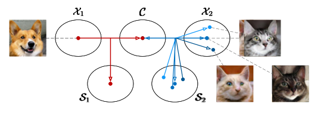

# Lecture 10 and 11: Conditional GANs, Image-to-Image Translation

## Unconditional vs. Conditional Models:

**Difference**: As mentioned by Lecture 8, unconditional models learn to model p(x), while conditional models aim to model p(y\|x), where x and y are conditional input information and output images. 

**Why do we care about conditional models?** While many unconditional models can synthesize realistic random samples during inference time, random sample generation is not helpful for many content creation applications where users want to create specific content according to their mental picture. For example, we often want to design a poster for a particular event rather than generating a random poster. If we enable a model to listen to the user-specified conditional input x, we can more expressively control the output image y=G(x). 

 

## Example-based vs. Learning-based: 

**Example-based methods**: Early data-driven graphics systems often use nearest neighbor matching + image blending pipeline (See Lecture 4 for more details). The idea is to find similar images/regions given the user input x and then use image blending techniques to combine multiple regions from different images and get the output y. It has several limitations. First, image/region retrieval can be slow and requires external datasets. Second, it is challenging to compose different pieces captured under different lighting, illumination, scale, camera poses, etc. 

**Learning-based methods**: we aim to learn a function directly from input and output data. During test time, we can get the results in real-time with y=G(x). The model size is also compact compared to storing the entire training set. 

See the following graph for a side-by-side comparison. 

## Training Conditional Models: 

**Objective**: The loss function needs to satisfy two constraints: (1) encourage the output y to be realistic, (2) enforce the correspondence between the input and output. Output needs to reflect the content of the input. 

 

Common training objectives include conditional GANs loss, feature matching loss (Perceptual Loss), L1/L2 loss, hybrid GAN loss, and feature matching loss (e.g., pre-trained features + trainable head, feature matching loss with discriminator’s features). Recent methods often use more than several training objective functions. Both L1/L2 loss and perceptual loss could improve the convergence and training stability of conditional GANs. 

 

**Generator architectures:**

1. **Avoid using information bottlenecks in the encoder-decoder architectures**. Use skip connections or ResNet blocks to preserve the input image's high-frequency information (edges). One popular choice is [U-Net](https://arxiv.org/abs/1505.04597). Using state-of-the-art segmentation networks could be a good starting point. To support images with varying image sizes, we should use [fully convolutional networks](https://arxiv.org/abs/1411.4038) (replacing the FC layer with 1x1 Conv).

2. **Avoid applying normalization layers to the input**: normalization layers may cause information loss of the input. We want to normalize the intermediate features using BatchNorm for stable training. But we do not want to normalize the input. Several conditional normalization layers have been proposed for image synthesis tasks, including [AdaIN](https://arxiv.org/abs/1703.06868), Conditional BatchNorm, and [SPADE](https://arxiv.org/abs/1903.07291). The idea is to compute beta and gamma parameters using an input “style” image.

3. **Coarse-to-fine generator**: We could use a coarse-to-fine training scheme for high-resolution image synthesis if directly training high-res generators does not work. We first train a generator to synthesize low-res outputs and then add additional layers for high-res synthesis. See [pix2pixHD](https://github.com/NVIDIA/pix2pixHD) and [StackGAN](https://arxiv.org/abs/1612.03242) for more details.
 

**Discriminator architectures**: 

1. **ImageGAN vs. PatchGAN**: Vanilla GAN discriminator learns to predict a scalar value (real/fake) given a single image. In contrast, PatchGAN learns to predict a map whose elements indicate a real/fake region.

2. **Multi-scale Discriminators**: Like coarse-to-fine generators, we can use multiple (patch-based) discriminators to classify regions at different scales.

**Data augmentation**: For a small-scale dataset (e.g., hundreds/thousands of images), data augmentation is still critical. Note that for an input-output pair, we need to synchronize data augmentation for certain types of augmentation (e.g., geometric transformation). For example, if we translate the input x by (5, -5), we must also translate the output y by (5, -5). If data augmentation is not synchronized, input and output images will no longer be aligned. 

## Multimodal Synthesis

We want our model to predict multiple outputs given the same input. This is helpful for content creation as our users can choose one from these candidates. Additionally, we can transfer the “style’ of a reference image to our output. If we feed the latent vectors z directly to the generator, the latent vectors will often get ignored entirely, as there is no need to use the latent vectors. There are several solutions. 

 

**Training multiple generators**: We can train K generators to cover K modes. We can train a K+1-way discriminator to classify whether the image is from the k-th mode or a real image. The generators often share weights in their earlier layers. The major limitation of the method is that it cannot model continuous factors (e.g., color, time, lighting). 

 

**Training generators with encoders**: We can train an encoder E to infer the latent code z from an output image G(x,z) with the following two loss functions: we want G(x. E(y)) to match the ground truth output y, and we want E(G(x, z)) to match z. We also add KL divergence to the latent vector z. 

 

**Using regularizers**: We can encourage our generators to produce different results given different latent vectors. The paper Diversity-sensitive GANs shows that this loss is the lower bound of the average gradient norm of the generator. This method does not require an auxiliary encoder model. But it requires us to find a good metric between two images. 

 

## The term "Multimodal": 

The term "Multimodal" could mean two different things in image synthesis. 

 

**Multimodal distribution/outputs**: It can refer to the fact that the model can produce multiple outputs given the same input. It's the opposite of [unimodality](https://en.wikipedia.org/wiki/Unimodality). 

 

Examples: [BicyleGAN](https://arxiv.org/abs/1711.11586), [MUNIT](https://arxiv.org/abs/1804.04732).

 

**Multiple modalities**: It can also refer to the fact that the model takes sensory data from different modalities (e.g., text, image, sketch) or produces outputs in different modalities:  

 

Examples:  [GauGAN2](http://gaugan.org/gaugan2/) can support multimodal inputs (e.g., segmentation, sketch, text) and their combinations (sketch+text). See the original [paper](https://arxiv.org/abs/2112.05130) (based on the [Product of Experts](https://en.wikipedia.org/wiki/Product_of_experts)) for more details. 

 

 

## Paired vs. Unpaired

**Paired (Supervised) Image-to-image Translation**: In Lecture 10, we have discussed several methods for learning conditional models given paired data <x_i, y_i>. We can use perceptual loss or conditional GANs loss to enforce the correspondence between x and y. The learning method is straightforward. But the data collection is not. For some cases, we can automate the process of creating pairs (e.g., edges2cats, in which we have an edge detector). Unfortunately, in many cases, paired data are hard to obtain due to several reasons:

(1) labeling costs associated with manual efforts and tedious processes,

(2) annotation requires expertise (e.g., photo -> painting of Claude Monet),

(3) input and output pairs are almost impossible to collect (e.g., horse -> zebra).

**Unpaired (Unsupervised) Image-to-Image Translation**: In unpaired image-to-image translation, we aim to learn a mapping between two domains, X and Y, without paired data. This is much more challenging for two reasons:

(1) As we don't have paired supervision, we can no longer use perceptual loss, conditional GAN loss, or L1/2 reconstruction loss. It is hard to enforce correspondence without correspondence supervision.

(2) we may learn something undesirable. Let's consider two domains (winter street view images and summer street view images). We may only want to learn a season transfer model across domains. But maybe two datasets are captured by different cameras, and our model might learn some warping functions across two cameras. Or maybe there are fewer cars in winter, and our model might tend to remove cars from our summer images.   

 

During your data preprocessing step, make sure that both datasets share some common features which you do not want to modify. For example, you can try to calibrate the camera viewpoint across domains. Or if you train a model for photo <-> painting, landscape photo <-> landscape painting is much easier to handle compared to landscape photo <-> portrait painting. 

 

Some authors use "unsupervised learning" as we do not need supervision regarding input and output pairs. But we still need to obtain domain labels (horse vs. zebra). See recent work (e.g., [TUNIT](https://arxiv.org/abs/2006.06500), [SwappingAutoencoder](https://arxiv.org/abs/2007.00653)) on a fully unsupervised setting without domain labels. 

 

## Additional constraints to enforce correspondence:

For unpaired settings, we can still use adversarial loss (GAN loss) to encourage the model to synthesize a zebra image. But the GAN loss alone cannot guarantee that our network learns to produce the correct zebra image corresponding to the input horse. We need to impose additional constraints. 

1. **Self-Regularization loss** (e.g., [SimGAN](https://openaccess.thecvf.com/content_cvpr_2017/papers/Shrivastava_Learning_From_Simulated_CVPR_2017_paper.pdf)): ||G(x)-x||. It encourages the model to preserve the input. It works well if input and output domains share similar pixel values. But it does not work if we want to learn large color, texture, and geometric changes. (e.g., red apple <-> green apple)

2. **Feature loss / F-constancy loss** (e.g., [DTN](https://openaccess.thecvf.com/content_cvpr_2017/papers/Shrivastava_Learning_From_Simulated_CVPR_2017_paper.pdf)): ||F(G(x)) - F(x)||. We can also encourage our model to preserve the input in feature space. F must be invariant under the mapping G:: i.e., F can produce similar feature embeddings of the same object across two domains. Note that this differs from the feature matching loss we used for paired image-to-image translation. (e.g., ||F(G(x)) - F(y)||) . In the paired case, network F only needs to work well for the target domain. For some domains, it might be possible to obtain such an F (e.g., face photos vs. face cartons). It might be difficult for other domains (e.g., sketch vs. image).

3. **Cycle-consistency loss** (e.g., [CycleGAN](https://junyanz.github.io/CycleGAN/), [DualGAN](https://arxiv.org/abs/1704.02510)): ||F(G(x)) - x||. We learn an inverse mapping network to return the output G(x) to the input domain. We no longer need a pre-trained network that works for both domains. But this comes at the cost of training a 2nd generator and its discriminator. The idea of cycle-consistency loss can be traced back to Mark Twain's Jumping Frog story. 

4. **Contrastive learning loss** (e.g., [CUT](https://github.com/taesungp/contrastive-unpaired-translation)). InfoNCE(patch(x), patch(G(x))) We learn an encoder to map input and output patches at the exact locations into nearby locations. This only works when there are no geometric changes involved in the mapping. Please see more details in Lecture 12. 

## Style and content loss functions: 

The main objective of image-to-image translation is to preserve the content of the input image while changing the style according to the target domain. We will further explain the definitions of style and content in Lecture 12. 

We can treat the GAN loss as a style loss. We can treat self-regularization loss, feature matching loss, cycle-consistency loss, and contrastive learning loss as our content loss. Conditional GAN loss and perceptual loss achieve both, but both require paired data. 

## Style and content latent space:

In addition to designing loss functions, we can also design the latent space of our networks to independently control the style and content of an input image. 

 

In the [UNIT](https://arxiv.org/abs/1703.00848) model, the authors encourage two domains to share the same latent space. 

In the [MUNIT](https://arxiv.org/abs/1804.04732) model, the authors use a style encoder, a content encoder, and a decoder for each domain. They encourage two domains to share the same content code space but allow each domain to learn its own style code space. This allows MUNIT to synthesize multiple outputs given the same input (by sampling different style codes for the target domain). 

**Multi-domain Image-to-Image Translation**: Due to the time limit, we didn't mention it in class. If you want to learn image-to-image translation models across N domains (e.g., photo, Van Gogh, Cezanne, etc.), a naive implementation will involve N x (N-1) generators and their corresponding discriminators. [StarGAN](https://github.com/yunjey/stargan) and [StarGAN-v2](https://github.com/clovaai/stargan-v2) (multimodal, high-res StarGAN) provide an efficient solution to address the above issue.