<!-- #  Note 12 -->

# Lecture 12: Style and Content, Texture Synthesis

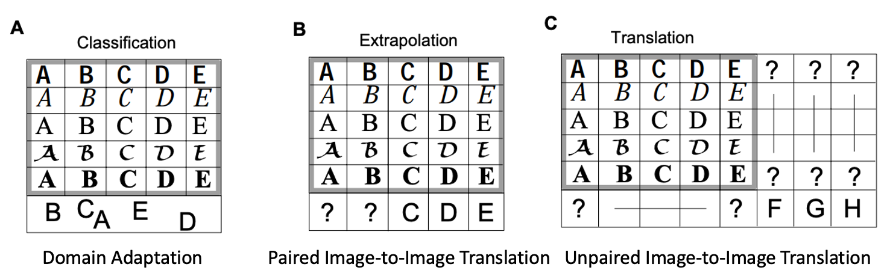 

## Style and Content Separation

In the paper “[Separating Style and Content with Bilinear Models](http://people.csail.mit.edu/billf/publications/Separating_Style_and_Content.pdf)”, the authors propose a bilinear model to solve style and content separation tasks. Such tasks include “identifying a font or handwriting style (style) across letters (content) or recognizing a familiar face or object (content) seen under unfamiliar viewing conditions (style). Given training data in multiple styles (e.g., fonts) and content classes (e.g., letters), a good factorization model should be able to learn to perform three tasks: 

1. Classification (domain adaptation): classify content observed in a new style. 

2. Extrapolation (paired image-to-image translation): extrapolate a new style to unobserved content classes. 

3. Translation (unpaired image-to-image translation): translate from new content observed only in new styles into known styles or content classes. 

 

Also, check out the Style and Content separation in the 3D shape collection ([paper](https://www.cs.sfu.ca/~haoz/pubs/xu_siga10_style.pdf)). 

 

## Patch-wise Contrastive Loss: 

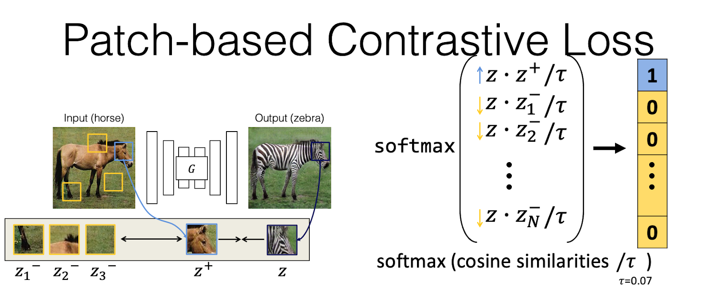

 

**Formulation**: Here, the query z is the feature embedding of the zebra head, positive key z+ is the feature embedding of the input horse head, and negative keys z- are feature embeddings of other randomly sampled patches. We want the input and output patches’ feature embedding to stay close while two randomly sampled patches’ features stay away from each other. 

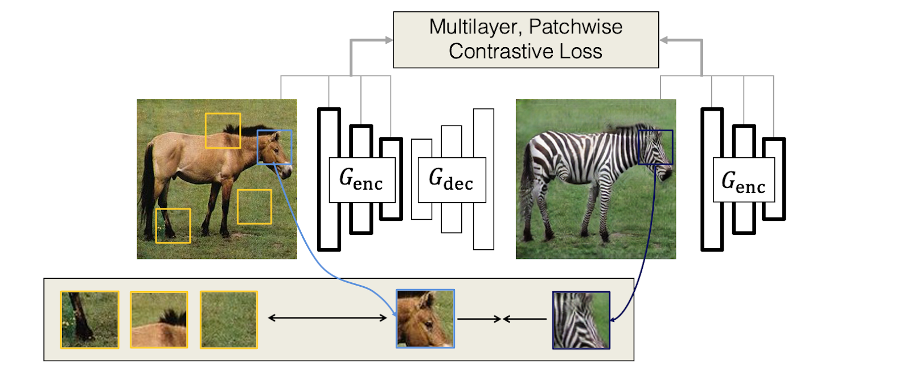

**Implementation**: We can extract these feature embeddings using a fully convolutional network (FCN). In particular, we can use the first half of our generator as the encoder G_enc. G_enc can produce a tensor feature map (e.g., HxWxC=16x16x512). This strategy is more efficient than explicitly cropping patches and computing features. We can compute this loss over features extracted from different layers. 

 

**Internal vs. external patches**: Using internal negative patches often works better than external patches (patches from other images in the database). External patches might hurt when a false negative patch (e.g., a horse head) is accidentally sampled from a different image.

 

## Non-parametric Texture Synthesis:

Texture synthesis algorithms aim to create a larger texture output, given a small sample. It is useful for many computer vision and graphics applications, such as image inpainting, image and video compression, and [texture rendering in 3D](https://johanneskopf.de/publications/solid/).  

 

Some texture synthesis websites from UC Berkeley, Stanford, and NYU. 

https://people.eecs.berkeley.edu/~efros/research/synthesis.html

http://graphics.stanford.edu/projects/texture/ 

http://www.cns.nyu.edu/~eero/texture/

 

**Pixel-based methods**:  [Efros and Leung, 1999](https://people.eecs.berkeley.edu/~efros/research/EfrosLeung.html) propose synthesizing an image pixel by pixel. The method will search the input image for all similar neighborhoods during each step. The distance is based on Gaussian-weighted SSD on the surrounding pixels that have been synthesized.

 

This idea is similar to autoregressive models (e.g., PixelCNN/PixelRNN), in which a network learns to synthesize the next pixel instead of using the nearest neighbor search. 

 

**The order matters a lot**. Pixels with more neighbors should be synthesized first. If no close match can be found, the pixel will not be synthesized until the end. Optimizing orders for auto-regressive models has been recently explored by [Mask-GIT](https://arxiv.org/abs/2202.04200). 

 
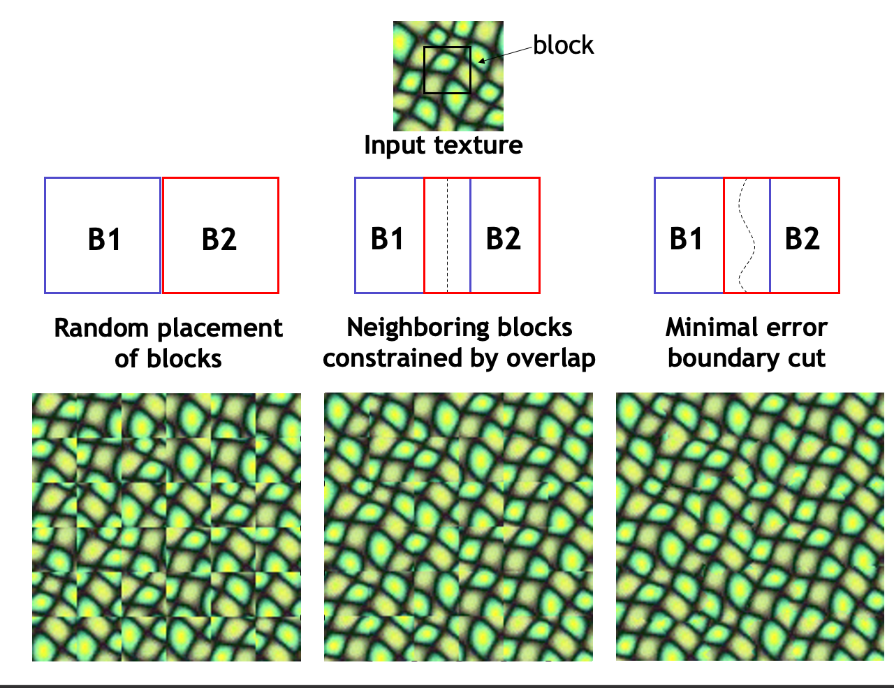

**Patch-based methods**: Synthesizing an image pixel by pixel is too slow. It involves many FOR loops (2 FOR loops for synthesizing every pixel + 2 FOR loops for computing SSD + 2 FOR loops for search). [Image Quilting](https://people.eecs.berkeley.edu/~efros/research/quilting/quilting.pdf) and [Liang et al.](https://people.csail.mit.edu/celiu/pdfs/TOG.pdf) accelerate the algorithm by synthesizing an image patch by patch. Since the texture within a single patch looks realistic, we only need to hide the visible seam between the two patches. In Image Quilting, they find overlapping patches and then optimize a minimum error boundary using the shortest path algorithm. The idea of minimum error boundary was later used in [Seam Carving](http://citeseerx.ist.psu.edu/viewdoc/download?doi=10.1.1.570.6321&rep=rep1&type=pdf) (for [image retargeting](https://faculty.cc.gatech.edu/~turk/my_papers/graph_cuts.pdf)) and GraphCut Texture (for image and video synthesis). The idea of auto-regressive models with larger synthesis blocks has been widely used by recent methods (e.g., VQ-VAE2 and VQ-GAN) in which a latent token represents a region. 

 
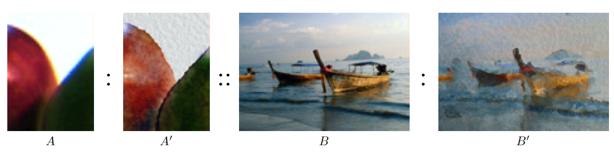

Texture Transfer: One new application of the Image Quilting paper is texture transfer, whose goal is to synthesize an output that shares the texture of a reference image while preserving the content of the input image. To achieve it, the authors added a correspondence constraint to the search criteria. The output patch should also be similar to the input image’s patch in pixel space. 

 

In the same year (2001), Image Analogy [Hertzmann et al.] was introduced to perform color and texture transfer given a single input-output pair. Image Analogy is a seminal work for recent deep learning applications such as image-to-image translation and neural style transfer. Aaron Hertzmann maintains an active [blog](https://aaronhertzmann.com/) about algorithms, art, photography, and academia. Feel free to check it out. 

 

**Fast nearest neighbor search**: As patch-based methods still take a few seconds for a megapixel image, various methods have been proposed to accelerate the nearest neighbor search, including coarse-to-fine search, approximate nearest neighbor search (e.g., vector quantization, Kd-tree, see [Wei and Levoy] and [Liang et al.]), and PatchMatch. PatchMatch can perform real-time image inpainting, image retargeting, and reshuffling. 

## Parametric Texture Synthesis and Neural Style Transfer:

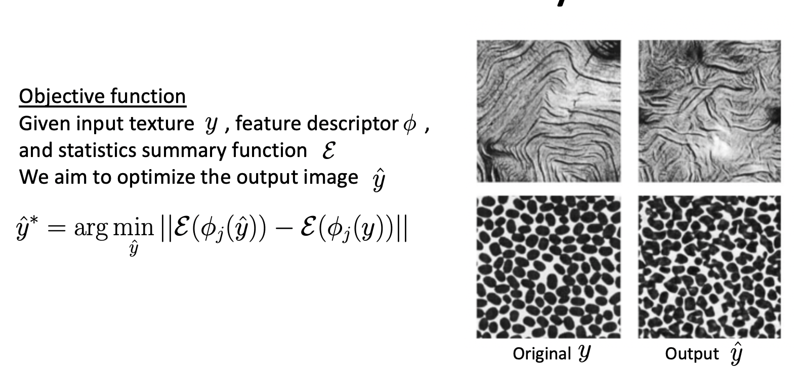

**Parametric methods for Texture Synthesis**: Another classic approach [Portilla and Simoncelli, 1999](https://link.springer.com/content/pdf/10.1023/A:1026553619983.pdf) for texture synthesis is to use a texture analysis model. The key motivation is to design a parametric texture analysis model to describe an input texture (input texture -> a texture descriptor). The main application of this texture model is for visual recognition tasks. But to visualize the model, researchers started synthesizing an output so that descriptor(output)= descriptor(input). In short, texture synthesis can be considered a good tool for understanding and visualizing texture models. The original paper proposes matching joint statistics in Wavelet feature space. 

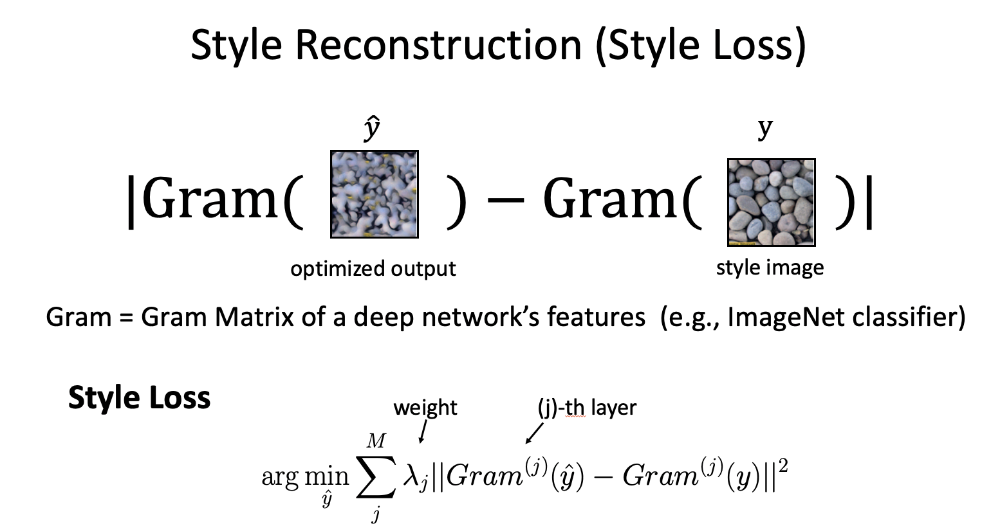

**Deep Learning version**: [Gatys et al., 2015](https://proceedings.neurips.cc/paper/2015/file/a5e00132373a7031000fd987a3c9f87b-Paper.pdf) extended this idea with modern deep learning. Instead of matching Wavelet feature statistics, they proposed matching Gram Matrix of deep learning features. The [Gram](https://en.wikipedia.org/wiki/Gram_matrix) matrix computes cross-channel correlation over all the spatial locations. Given an HxWxC tensor, the Gram Matrix should be CxC, and the location information of each feature has been discarded (through averaging). This loss function is often called Style loss. Interestingly, the initial motivation of Leon Gatys and his colleagues is to visualize what a deep network has learned (rather than image synthesis applications). They found that CNN cares more about texture rather than shape. 

 
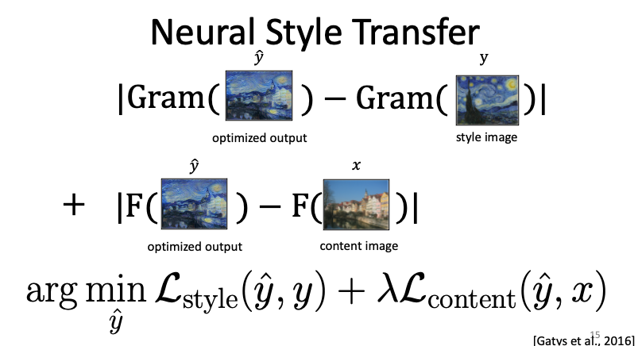

**Neural Style Transfer**: [Gatys et al., 2016](https://www.cv-foundation.org/openaccess/content_cvpr_2016/papers/Gatys_Image_Style_Transfer_CVPR_2016_paper.pdf) further applied the above idea to texture transfer, and created a well-known algorithm called Neural Style Transfer. The algorithm aims to synthesize a novel image by combining the content of one image with the style of another image (typically a painting).  Here, the style loss (first term) is the Gram Matrix matching loss between the output image and the style image, while the content loss (2nd term) is the perceptual loss (feature matching loss) between the content image and output image. Both loss functions use pre-trained neural networks. We often initialize the output with the content image. 

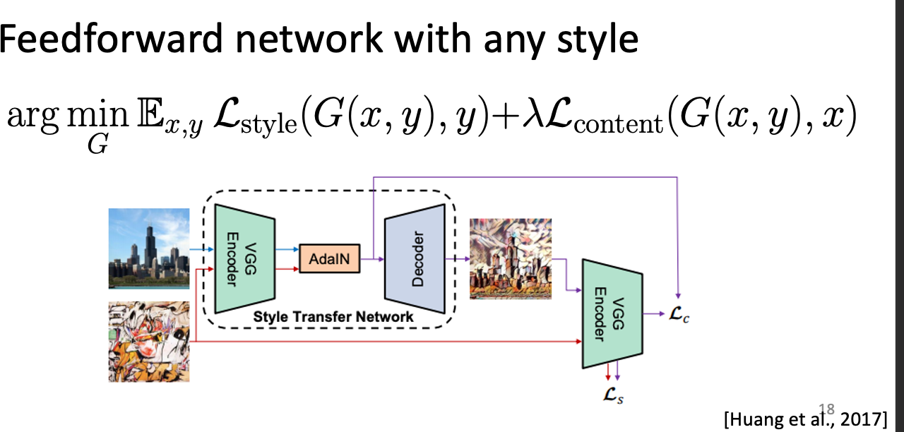

**Fast Neural Style Transfer with Any Style**: It often takes several minutes to get a good output as we solve an optimization problem with millions of pixels. (Each pixel is an unknown variable). One trick to speed up any optimization problem is to train a neural network that takes the known variables as input and predicts unknown variables. For example, if we want to solve the following equation:

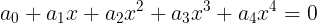

We can train a network E and plug E’s output into the above equation. We can minimize the L2 training error over many randomly sampled a_1, a_2, .., a_4. 

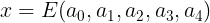

Here Arbitrary Style Transfer [Huang et al.](https://arxiv.org/abs/1703.06868) did the same thing. For neural style transfer, the known variables are the input content image x and the style image y. So we design an AdaIN-based network that can take both inputs. We then replace our \hat{y} by the network G’s output and minimize the same style and content loss over many combinations of content image x and style image y.

 

## Different Definitions of Style and Content

**Image-to-Image Translation**: Style refers to domain-specific features (horse vs. zebra), and Content refers to common features shared by both domains (horse and zebra head, body). 

 

**Multi-modal Image-to-Image Translation (UNIT/MUNIT)**: Style refers to variations within the same domain (different colors, textures, etc.). Content refers to common features shared by both domains. 

 

**Neural Style Transfer ([Gatys et al.])**: Style refers to image statistics (color, texture, etc.) of a single painting. Content refers to the scene layout and semantics of a real photo.

## Neural Style Transfer vs. Image-to-Image Translation: 

1. Neural style transfer focuses on the style of a single reference painting, while image-to-image translation focuses on modeling the style of a domain. 

2. Neural style transfer does not work well for photo -> photo or painting -> photo. It works well for photo -> painting. 

 

Deep photo style transfer (e.g., [Luan et al.,](https://arxiv.org/abs/1703.07511), fast [version](https://openaccess.thecvf.com/content_ECCV_2018/papers/Yijun_Li_A_Closed-form_Solution_ECCV_2018_paper.pdf)) = Neural style transfer + Photorealism loss (assumption: locally smooth affine color transformation). 

 

Single Image Translation (e.g., [CUT](https://arxiv.org/pdf/2007.15651.pdf)) = Training an image-to-image translation model on a single image per domain. We must use aggressive data augmentation (random crops, different scales) to avoid model overfitting. 

 

## Summary: 

Instead of studying the differences between individual papers (10,000+ papers), it’s easier to understand different design choices under several categories: data, applications, algorithms, and loss functions. 

 

**Data**: 

1. A single image.

2. An image collection: differences across two domains vs. differences between two images within the same domain.  

**Applications**: 

1. Photo -> Painting: Neural Style Transfer, Image-to-Image Translation.  

2. Photo -> Photo: Image-to-Image Translation, Photo Style Transfer. 

3. Painting -> Photo: Image-to-Image Translation, (Deep) Image Analogy.  

 

**Algorithms**: 

1. Patch-based method: explicitly finding correspondence between output and input. It could be accelerated with fast nearest-neighbor search methods such as PatchMatch. It often works for a single-style image. It does not work for large-scale datasets, as searching patches in large-scale datasets could be slow, and combing patches from different images is difficult.

           Examples: Non-parametric texture synthesis, Image Analogy, and Deep Image Analogy. 

2. Optimization-based method: optimizing output pixels via an objective function. The method could be slow at test time. 

           Examples: Neural Style Transfer, Deep Photo Style Transfer

3. Feed-forward network: training a feedforward network with an objective function over many training images. The network runs fast during test time. But it requires collecting training input and output images and a very long training time.

          Examples: Fast Neural Style Transfer, Image-to-Image Translation

**Loss functions**: 

1. Style loss: Adversarial loss, Style loss (Gram Matrix loss)

2. Content loss:  Self-Regularization loss, F-constancy loss (feature loss), Cycle-consistency loss, Patch-wise Contrastive loss. 

3. Losses for both style and content: Perceptual loss and conditional GAN loss. Both loss functions require paired training data. 